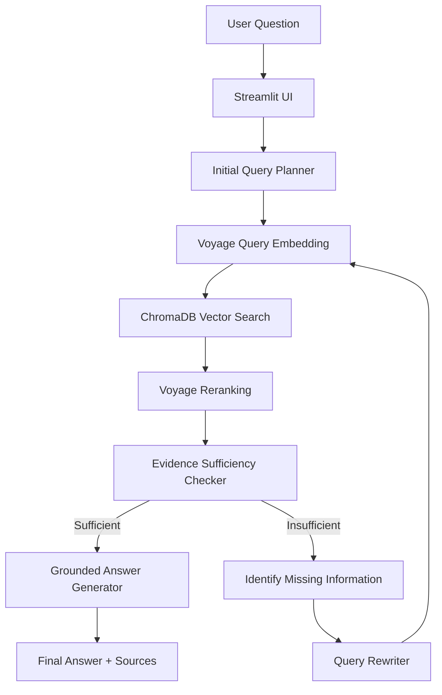

# Ashen Era Agentic Search

**SLIIT Codefest 2026 AI Competition**  
**Sub-Track:** 1C — Searching the Way a Human Does

---

## Overview

Ashen Era Agentic Search is an iterative document-research assistant built for Sub-track 1C.

Instead of performing one retrieval step and immediately answering, the system follows a human-like research loop:

1. Plan an initial search.
2. Retrieve evidence from the Ashen Era Archive.
3. Check whether the evidence is sufficient.
4. Identify missing information.
5. Rewrite the query when required.
6. Search again and accumulate evidence.
7. Generate a grounded answer with source information.

This allows the system to handle multi-step questions and conflicting archive sources more effectively than a single-turn retrieval workflow.

---

## Team & Roles

| Member | Name | Responsibility |
|---|---|---|
| Member 1 | Ifaza | Document ingestion, chunking, metadata, Voyage embeddings, ChromaDB vector store, retrieval and reranking |
| Member 2 | Abdullah | Groq LLM client, planner, evidence checker, query rewriter, iterative search loop and answer generation |
| Member 3 | Sameeha | Streamlit UI, backend integration, search visualization, error handling and demo preparation |
| Member 4 | Rithika | Evaluation harness, benchmark testing, QA, limitation analysis and submission documentation |

---

## Architecture



Comprehensive architecture specifications, multi-round state machine, component sequence diagrams, and source authority resolution hierarchies are documented in [docs/architecture.md](docs/architecture.md). Key design rationale and architectural decisions are documented in [docs/decisions.md](docs/decisions.md).

---

## Execution Modes

### Simulation Mode

Simulation Mode provides deterministic benchmark traces for offline testing and presentation support.

It does not silently replace failed live execution. Unsupported simulation questions return a clear message instead of inventing an answer.

### Live Agent Pipeline

Live Mode executes the real Track 1C pipeline:

```text
Question
→ Planner
→ Voyage Query Embedding
→ ChromaDB Retrieval
→ Voyage Reranking
→ Evidence Sufficiency Check
→ Query Rewrite if needed
→ Grounded Answer
```

The live agent is connected through:

```python
from src.retrieval.search import search
```

A populated local ChromaDB index is required for full-archive live retrieval.

---

## Setup

### 1. Clone the Repository

```bash
git clone <repository-url>
cd AI-Avengers-codefest-2026
```

### 2. Install Dependencies

```bash
pip install -r requirements.txt
```

### 3. Configure Environment Variables

Copy `.env.example` to `.env`.

Windows PowerShell:

```powershell
Copy-Item .env.example .env
```

Linux/macOS:

```bash
cp .env.example .env
```

Add your own keys:

```dotenv
GROQ_API_KEY=your_groq_api_key_here
VOYAGE_API_KEY=your_voyage_api_key_here
LLM_MODEL=llama-3.3-70b-versatile
```

Never commit the real `.env` file.

---

## Prepare the Ashen Era Corpus

Place the extracted competition corpus at:

```text
data/
└── corpus/
    └── Ashen_Era_Archive/
        ├── chronicles/
        ├── wiki/
        ├── codex/
        ├── ephemera/
        └── images/
```

The corpus itself is intentionally excluded from Git.

---

## Build the Local Vector Index

Run:

```bash
python -m src.retrieval.index_corpus
```

For accounts with low Voyage API rate limits, use a smaller embedding batch:

```bash
python -m src.retrieval.index_corpus --batch-size 4
```

The indexer checks existing chunk IDs, so interrupted indexing can be resumed without duplicating previously stored chunks.

The generated ChromaDB database is stored at:

```text
data/vector_db/
```

This directory is intentionally excluded from Git because it is generated locally.

Check index status with:

```bash
python check_index_status.py
```

or:

```bash
python -c "from src.retrieval.vector_store import ChromaVectorStore; s=ChromaVectorStore(); print('Indexed chunks:', s.count())"
```

---

## Run the Application

```bash
streamlit run src/app.py
```

Alternative entry point:

```bash
streamlit run app.py
```

Then open:

```text
http://localhost:8501
```

For real archive search, select:

```text
Live Agent Pipeline (src.agent.search_agent)
```

---

## Run the Agent from the CLI

```bash
python -m src.agent.search_agent
```

---

## Evaluation

Run:

```bash
python -m src.evaluation.evaluate
```

Evaluation results are saved with timestamps in:

```text
src/evaluation/results/
```

---

## Tests

Run:

```bash
python -m unittest discover tests
```

or, where applicable:

```bash
pytest
```

---

## Known Limitations

- Standalone PNG figure plates are not indexed by the current text ingestion pipeline.
- Image-only or scanned content without extractable text may not be searchable because OCR is not currently implemented.
- DOCX files do not always provide reliable rendered page numbers.
- Live Mode depends on Groq and Voyage AI availability and rate limits.
- The agent uses a configurable maximum search-round limit.
- Retrieval quality still depends on finding the most authoritative evidence when archive sources conflict.
- The local vector index is generated separately and is not stored in Git.

See `docs/limitations.md` for the full discussion.

---

## AI Usage

AI tools were used as development, debugging, review and documentation assistants.

Full disclosure is available in:

```text
ai_usage/ai-usage-disclosure.md
```

Exported development chat logs are stored in:

```text
ai_usage/chat_logs/
```

---

## Documentation

- `docs/architecture.md` — system architecture
- `docs/decisions.md` — technical decisions
- `docs/experiments.md` — experiments and evaluation history
- `docs/limitations.md` — known limitations
- `docs/demo_script.md` — final demonstration guide
- `docs/evaluation-rubric.md` — internal evaluation rubric
- `docs/submission_report_draft.md` — report source
- `ai_usage/ai-usage-disclosure.md` — AI usage disclosure
