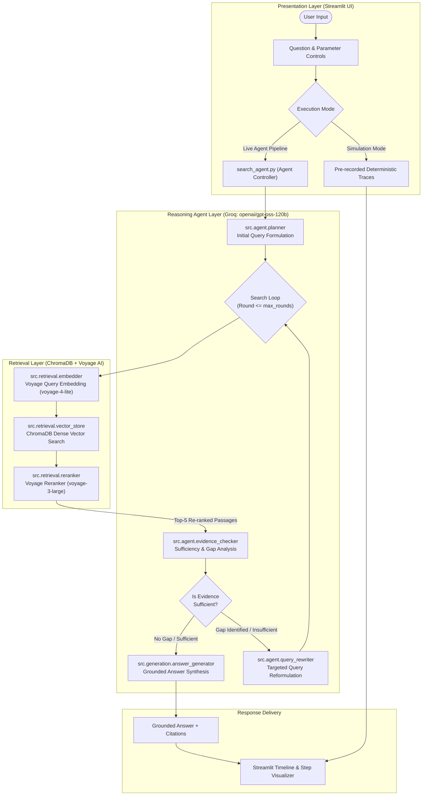
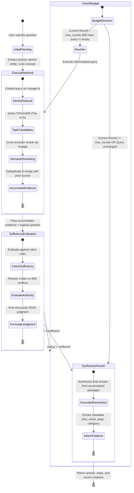
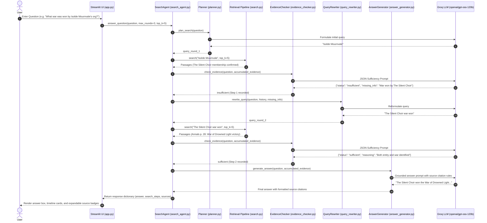
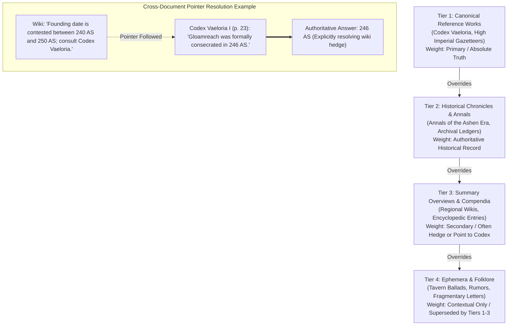

# System Architecture

## 1. Overview

**Ashen Era Agentic Search** is an iterative, multi-hop research assistant built for **SLIIT Codefest 2026 Sub-Track 1C: "Searching the Way a Human Does"**.

Standard Retrieval-Augmented Generation (RAG) pipelines follow a single-shot paradigm: query in, vector similarity search, single LLM response. However, realistic archive research—such as investigating the fractured chronicles of the Ashen Era—requires dealing with:
- **Multi-hop dependencies**: E.g., discovering which organization a figure belonged to, and then finding what war that organization won.
- **Source conflicts and hedges**: Lower-authority summaries (wikis, rumors) that hedge key facts or contradict canonical records (codices, gazetteers).
- **Incomplete or unanswerable queries**: Recognizing when evidence is insufficient without hallucinating.

Our system mirrors human research behavior through a closed-loop reasoning process: planning targeted queries, evaluating evidence completeness, reformulating searches to close identified gaps, and synthesizing fully cited answers.

---

## 2. Architecture & Data Flow Diagram

---

## 3. Detailed Multi-Round State Machine

The iterative research loop is governed by clear stopping rules, deduplication guards, and conflict-resolution heuristics.

---

## 4. Component Interaction Sequence Diagram

The following sequence diagram illustrates the lifecycle of a multi-hop query across system components:

---

## 5. Source Authority Hierarchy & Conflict Resolution

The Ashen Era Archive deliberately includes epistemic uncertainty and conflicting accounts. The system enforces an explicit authority hierarchy:

---

## 6. Component Directory Structure

| Module | File | Core Functionality |
|---|---|---|
| **Agent Controller** | `src/agent/search_agent.py` | Orchestrates multi-round loop, stops when sufficient or budget met, handles dedup guards |
| **Initial Planner** | `src/agent/planner.py` | Distills user question into focused first-turn query targeting primary entity |
| **Sufficiency Checker** | `src/agent/evidence_checker.py` | Returns structured JSON `status`, `reasoning`, and `missing_information` |
| **Query Rewriter** | `src/agent/query_rewriter.py` | Formulates targeted search queries bridging specific gaps across rounds |
| **Answer Generator** | `src/generation/answer_generator.py` | Synthesizes grounded markdown answer citing document names and page numbers |
| **LLM Client** | `src/llm/client.py` | Robust Groq client with exponential backoff retry and markdown-safe JSON parsing |
| **Document Ingestion**| `src/retrieval/ingest.py` | Parsers for PDF, DOCX, TXT, and Markdown files in the Ashen Era Archive |
| **Embedding Engine** | `src/retrieval/embedder.py` | Batch embedding generation using Voyage AI API |
| **Vector Store** | `src/retrieval/vector_store.py` | Persistent ChromaDB collection management with idempotent chunk upsert |
| **Cross-Reranker** | `src/retrieval/reranker.py` | Voyage reranking with defensive fallback to vector similarity scores |
| **Search Pipeline** | `src/retrieval/search.py` | Unified retrieval entry point: embed -> query -> rerank |
| **Web Interface** | `src/app.py` | Modern Streamlit UI with multi-round timeline, dark-mode CSS, and dual backends |
| **Evaluation Suite** | `src/evaluation/evaluate.py` | Automated 8-question benchmark runner evaluating accuracy, reasoning, and citations |

