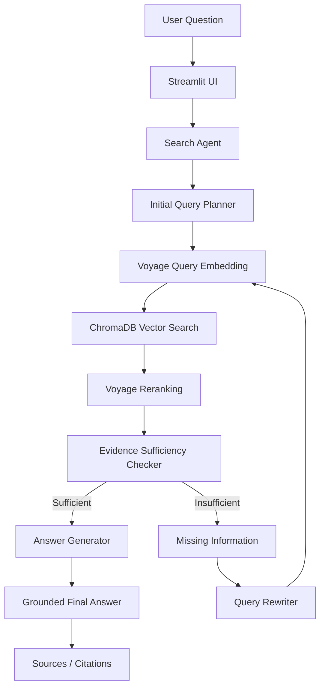

# System Architecture

## Overview

Ashen Era Agentic Search is an iterative research system for SLIIT Codefest 2026 Sub-track 1C.

The system does not rely on a single retrieval step. It plans a search, retrieves archive evidence, judges whether the evidence is sufficient, identifies missing information, rewrites the query when required, and repeats until it can produce a grounded answer or reaches the configured search-round limit.

## Architecture Diagram



## Component Responsibilities

### Streamlit UI
Provides the user interface, execution-mode selection, search parameters, search-round visualization, grounded answers and source display.

### Initial Query Planner
Creates the first search query from the user's question.

### Voyage Query Embedding
Transforms the search query into a semantic vector.

### ChromaDB Vector Search
Retrieves semantically similar chunks from the locally indexed Ashen Era Archive.

### Voyage Reranking
Reranks retrieved candidates so the strongest evidence is considered first.

### Evidence Sufficiency Checker
Determines whether the accumulated evidence is enough to answer the original question.

### Query Rewriter
Uses the identified information gap to create the next targeted search query.

### Answer Generator
Produces the final grounded answer from accumulated evidence.

## Persistence

The Ashen Era Archive is indexed locally into:

```text
data/vector_db/
```

The generated vector database is excluded from Git and can be rebuilt using:

```bash
python -m src.retrieval.index_corpus
```

## Execution Modes

The UI retains an optional deterministic Simulation Mode for offline testing.

The Live Agent Pipeline uses the real retrieval path through:

```python
from src.retrieval.search import search
```

Live execution requires valid Groq and Voyage API credentials and a populated local ChromaDB index.
