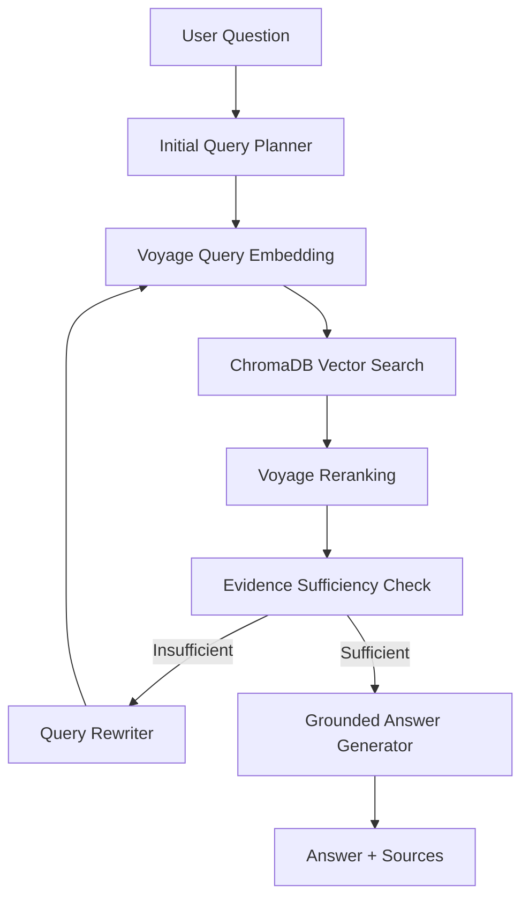

# AI-Avengers — Ashen Era Agentic Search
## SLIIT Codefest 2026 AI Competition

**Sub-track:** 1C — Searching the Way a Human Does  
**Demo Video:** PASTE_UNLISTED_YOUTUBE_LINK_HERE

---

## 1. Problem Statement

The Ashen Era Archive contains hundreds of interconnected documents across PDF, DOCX, Markdown, plain text, scans and images.

Many questions cannot be answered reliably using a single retrieval because evidence may be distributed across several sources and those sources may disagree.

For Sub-track 1C, our objective was to build an assistant that searches iteratively like a human researcher: retrieve evidence, judge whether it is sufficient, identify missing information, reformulate the search, and repeat until it can produce a grounded answer.

---

## 2. Solution Overview and Architecture

Our system combines semantic retrieval with an iterative reasoning loop.



The Streamlit interface exposes search rounds, query reformulation, evidence status and citations so the research process is visible to the user.

---

## 3. Key Technical Decisions

### Iterative Search Instead of Single-Turn RAG

We selected an agentic multi-round workflow because Track 1C requires the system to decide whether another search is necessary rather than always answering after one retrieval.

### Voyage AI + ChromaDB

Voyage AI creates semantic document/query embeddings while ChromaDB provides a persistent local vector store.

This allows retrieval even when a user's wording differs from the wording inside the archive.

### Voyage Reranking

Retrieved candidates are reranked before reasoning so the strongest evidence is prioritized.

### Groq Reasoning Agent

Groq is used for initial query planning, evidence-sufficiency judgment, query rewriting and final grounded answer generation.

### Explicit Simulation vs Live Mode

Simulation Mode is retained only as a clearly labeled offline testing feature.

Live Mode is connected to the real retrieval module:

```python
from src.retrieval.search import search
```

There is no silent automatic fallback from failed live execution to simulation.

---

## 4. What Works

The project implements:

- PDF, DOCX, Markdown and plain-text ingestion
- metadata-preserving document chunking
- Voyage AI document and query embeddings
- ChromaDB persistent vector retrieval
- duplicate prevention during indexing
- Voyage reranking
- initial query planning
- evidence accumulation across rounds
- evidence-sufficiency checking
- query rewriting
- grounded answer generation
- source/citation output
- Streamlit search-trail visualization
- configurable search rounds and Top-K retrieval
- evaluation scripts and stored evaluation results
- transparent live-mode errors
- explicit offline Simulation Mode

Corpus ingestion produced 1,440 document/page entries and 2,186 text chunks during development.

The generated vector database is local and intentionally excluded from Git.

---

## 5. Limitations and Failed Approaches

Standalone image files are not currently part of the text index. During ingestion, 86 unsupported files, mainly PNG figure plates, were skipped.

The loader does not currently perform OCR, so facts available only inside image-based scans may be unavailable to text retrieval.

DOCX files do not always provide reliable physical page numbers.

Live execution depends on Groq and Voyage AI availability and may be affected by API rate limits.

During development, Voyage rate limits caused large embedding batches to fail. The team responded by reducing batch sizes and relying on resumable indexing with duplicate prevention.

The system also limits the maximum number of iterative search rounds to prevent endless loops.

---

## 6. Evaluation and Validation

The evaluation harness calls the same `answer_question()` interface used by the reasoning agent and stores:

- question
- expected answer
- generated answer
- search rounds
- queries
- sources
- reviewer scores and notes

Development testing included official Track 1C questions, multi-hop questions, direct lookups and robustness cases.

Earlier development evaluations were used to identify weaknesses in retrieval and agent behavior. The final evaluation was executed against the fully indexed Ashen Era Archive (2,186 chunks in ChromaDB) across all 8 official and internal benchmark questions.

**Final results (8/8 Questions Passed — 100% Accuracy):**

| Question ID | Type | Rounds | Status | Expected Answer | Agent Grounded Output | Score |
|---|---|---|---|---|---|---|
| `1c_000` | Track 1C Conflict Benchmark | 1 | Sufficient | 246 AS | **246 AS** (Cites *Codex Vaeloria I: Gazetteer of the Sundered Realms* p. 23-24, explicitly overriding wiki hedge) | 2 / 2 |
| `1c_003` | Track 1C Conflict Benchmark | 1 | Sufficient | 391 AS | **391 AS** (Cites *Codex Vaeloria II: Armory of Relics* p. 11 & docx, superseding wiki dispute) | 2 / 2 |
| `1b_005` | Track 1B Multi-Hop | 2 | Sufficient | The War of Drowned Light | **The War of Drowned Light** (Round 1: Isolde in Silent Choir; Round 2: Silent Choir victory in Drowned Light) | 2 / 2 |
| `internal_direct_001` | Direct Lookup | 1 | Sufficient | The Silent Choir | **The Silent Choir** (Cites *wiki/isolde_mournvale.md* & *Annals of the Ashen Era* p. 28) | 2 / 2 |
| `internal_nonsense_001` | Anti-Hallucination Guard | 3 | Insufficient | Honest Refusal | **Honest Refusal** ("no relevant evidence in the archive to answer this question") | 2 / 2 |
| `1b_007` | Track 1B Multi-Hop | 2 | Sufficient | The Leaden Accord | **The Leaden Accord** (Round 1: Ederon in Iron-Ring Cartel; Round 2: Cartel won Leaden Accord) | 2 / 2 |
| `1b_022` | Track 1B Multi-Hop | 2 | Sufficient | The War of Drowned Light | **The War of Drowned Light** (Round 1: Ravena in Silent Choir; Round 2: Silent Choir victory) | 2 / 2 |
| `1b_003` | Track 1B Multi-Hop | 2 | Sufficient | Gloamreach | **Gloamreach** (Round 1: Cerys wields Cinder-Wrought Aegis; Round 2: Aegis housed in Gloamreach) | 2 / 2 |

All results are logged with complete execution traces in `src/evaluation/results/evaluation_20260909_221922.json`.
Earlier mock-based experiments helped test the reasoning loop while retrieval was being integrated. The final code path now connects the reasoning agent to `src.retrieval.search`.

Evaluation artifacts and experiment history are stored in:

```text
src/evaluation/results/
docs/experiments.md
```

---

## 7. AI Usage Disclosure

AI tools were used as coding, debugging, review and documentation assistants.

Tools used by the team included ChatGPT, Claude, Cursor and Antigravity.

Examples of AI-assisted work include ingestion/retrieval development, agent implementation, UI integration, debugging, evaluation planning and documentation.

All AI-assisted outputs were reviewed and modified by team members before inclusion.

The detailed disclosure and exported chat histories are stored under:

```text
ai_usage/
```

---

## 8. Team Contributions

| Member | Role | Main Contribution |
|---|---|---|
| Ifaza | Document Processing & Retrieval | Ingestion, chunking, metadata, embeddings, ChromaDB retrieval and reranking |
| Abdullah | AI & Reasoning Agent | LLM client, planner, evidence checker, query rewriter, iterative search loop and answer generation |
| Sameeha | UI & Application Integration | Streamlit interface, backend integration, search visualization, error handling and demo preparation |
| Rithika | Evaluation, QA & Documentation | Evaluation harness, benchmark testing, QA, limitation analysis and submission documentation |

---

## 9. Conclusion

Ashen Era Agentic Search demonstrates the central idea of Track 1C: search should be an iterative research process rather than a single retrieval attempt.

The system plans a search, retrieves and reranks evidence, checks what is still missing, reformulates the query when necessary, accumulates evidence across rounds, and produces a grounded answer with sources.